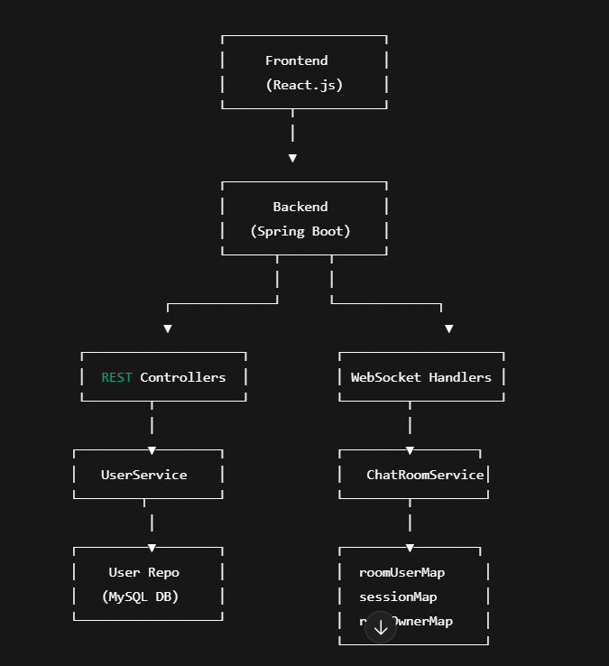
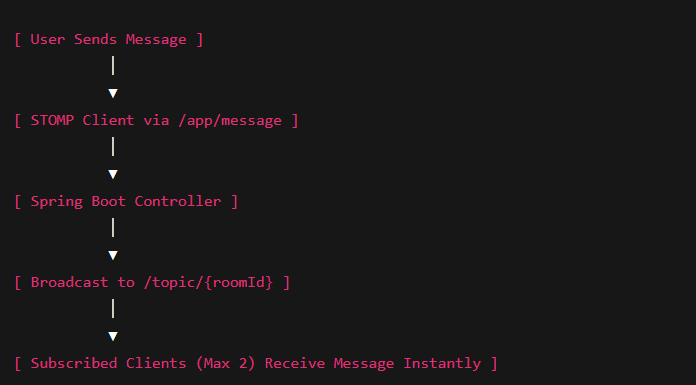
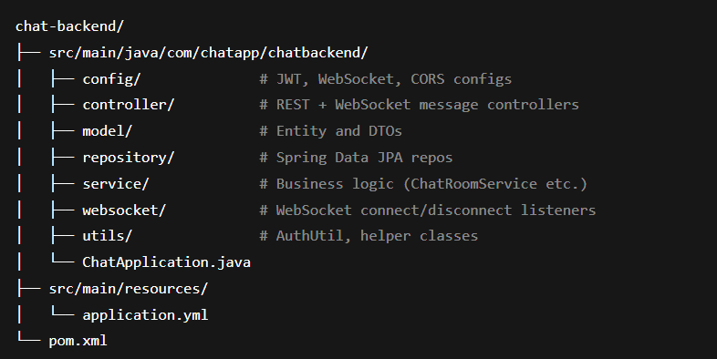
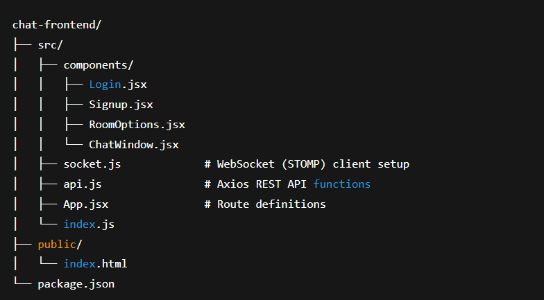

# 🗣️ ID-Based One-to-One Chat Room App (Spring Boot + React)

A complete real-time **1:1 chat application** that allows users to connect via **Room IDs** with different **joining modes**. It supports both authenticated and guest users, includes a clean React frontend, and a robust WebSocket + RESTful Spring Boot backend.

---

## 📌 Table of Contents

- [📖 About the Project](#about-the-project)
- [🎯 Aim](#aim)
- [✨ Key Features](#key-features)
- [🧠 Project Architecture](#project-architecture)
- [🔁 Chat Flow Diagrams](#chat-flow-diagrams)
- [⚙️ Technologies Used](#technologies-used)
- [🗂️ Folder Structure](#folder-structure)
- [🚀 Getting Started](#getting-started)
- [🧪 How to Test the App](#how-to-test-the-app)
- [📌 Important Notes](#important-notes)
- [📷 Screenshots (Optional)](#screenshots-optional)
- [🙌 Future Improvements](#future-improvements)

---

## 📖 About the Project

This is a **real-time, ID-based chat system** that allows exactly **two users per room**. It's designed to allow flexible joining:

- Create your own room
- Join any random available room
- Join a specific room via Room ID

The app uses:

- **Spring Boot** (backend)
- **WebSocket + STOMP** (chat in real-time)
- **JWT** (secure APIs)
- **React** (frontend)
- **TailwindCSS** (for clean UI)

---

## 🎯 Aim

> To learn websocket technology and create a **production-grade, scalable, and secure** 1:1 chat platform that focuses on clean separation of backend/frontend, real-time communication, and intuitive user experience with minimal setup.

---

## ✨ Key Features

### 🔒 Authentication
- Register / Login via JWT
- Guest login (temporary user, no account)
  
### 📬 Chat Room Features
- Room-based 1:1 chat
- Only two users per room
- Messages broadcasted in real-time using **WebSocket + STOMP**
- Online/offline status per user
- Chat stored in DB for later retrieval (if required)

### 🔗 Room Join Modes
1. **Create Room** — Generate a new unique Room ID (temporarily)
2. **Join Random Room** — Auto-join an active, singly occupied room randomly if available any
3. **Join Specific Room** — Enter a Room ID and join directly if avaialable any

### 🧼 Data Privacy Features
- Profile API does **not expose user ID** in request path or parameters
- Room access is controlled by real-time session state (no user info leak)

---

## 🧠 Project Architecture

### 🧠 Project Architecture

  

---

## 🔁 Chat Flow Diagrams

### 🧑‍💻 Client-Server Message Flow

  

---

## ⚙️ Technologies Used

| Layer      | Tool / Library              |
|------------|-----------------------------|
| Frontend   | React, Tailwind CSS         |
| Backend    | Spring Boot, Spring Security, WebSocket, STOMP |
| Auth       | JWT                         |
| Messaging  | SockJS, STOMP               |
| Database   | MySQL    |
| Build Tool | Maven                       |

---

## 🗂️ Folder Structure

### 📁 Backend (\`springboot-chat\`)

  

### 📁 Frontend (\`react-chat\`)

  

---

## 🚀 Getting Started

### 🧱 Prerequisites

- Node.js ≥ 16
- Java ≥ 17
- Maven
- MySQL
- Git

### 🔧 Backend Setup

\`\`\`bash
cd chat-backend
# configure application.yml or application.properties
mvn clean install
mvn spring-boot:run
\`\`\`

### 🎨 Frontend Setup

\`\`\`bash
cd chat-frontend
npm install
npm start
\`\`\`

App will run on: \`http://localhost:3000\`  
Backend runs on: \`http://localhost:8080\`

---

## 🧪 How to Test the App

### 🔐 Auth
- You can create/register two users. You can use invalid email ID (kept for easy access and testing)
- Authenticated users get JWT token

### 🧑‍🤝‍🧑 Room Options
1. Create room → share Room ID with someone else
2. Join Random → if someone already created and waiting
3. Join Specific → enter the ID manually and join single-occupied available room if any

### 💬 Chat
- Type messages and see them update in real-time
- When one user closes browser, the second stays connected
- Room is auto-closed if no one is left

---

## 📌 Features

- RoomId is generated on-demand — not stored statically
- Chat is available only for two users
- Profile API avoids userId in path/query to prevent data leaks
- Uses SockJS for broader browser compatibility
- Session cleanup handles unexpected disconnects

---

## 📷 Screenshots (Optional)

- Landing page with join modes
- Chat window (with messages and live updates)
- Profile page with delete options
- Toast notifications for errors and success

---

## 🙌 Future Improvements

- Chat history persistence and retrieval
- Add avatars / nicknames for better UX
- Typing indicators
- Message seen/read receipts
- Emoji/sticker support

---

## 👨‍💻 Author

- Developed by **Gourav Singh**
- GitHub: [trulyGourav](https://github.com/TrulyGourav)

